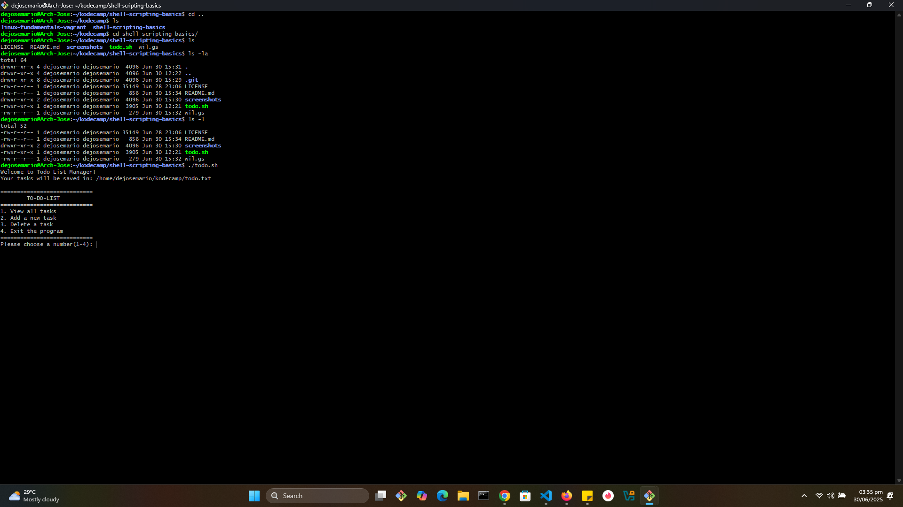
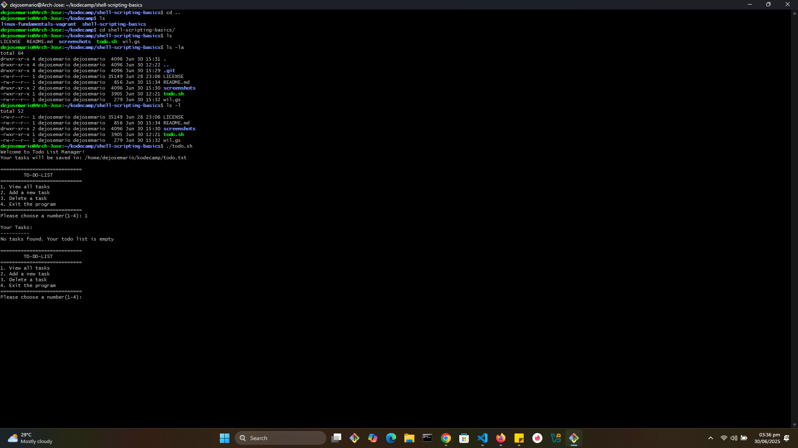
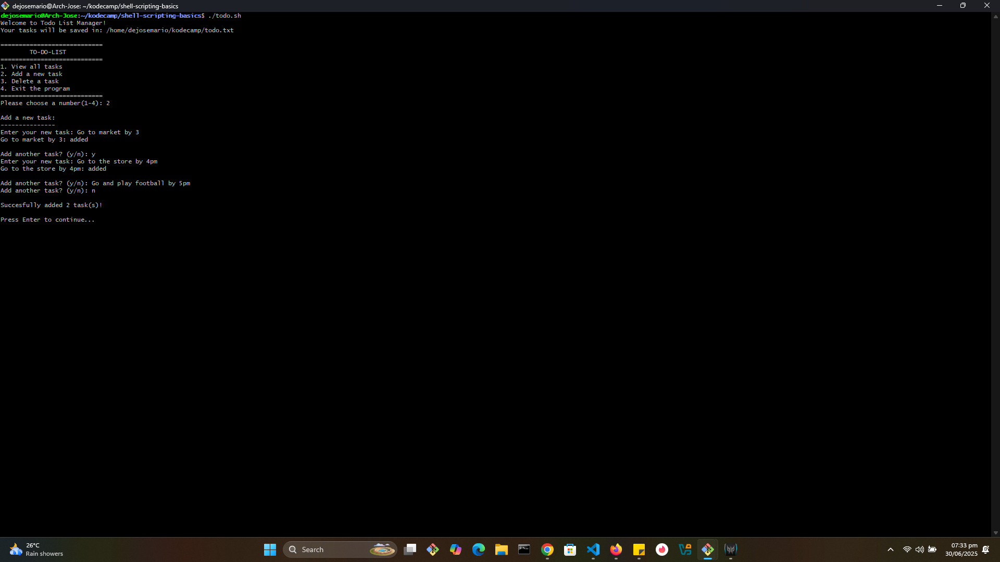
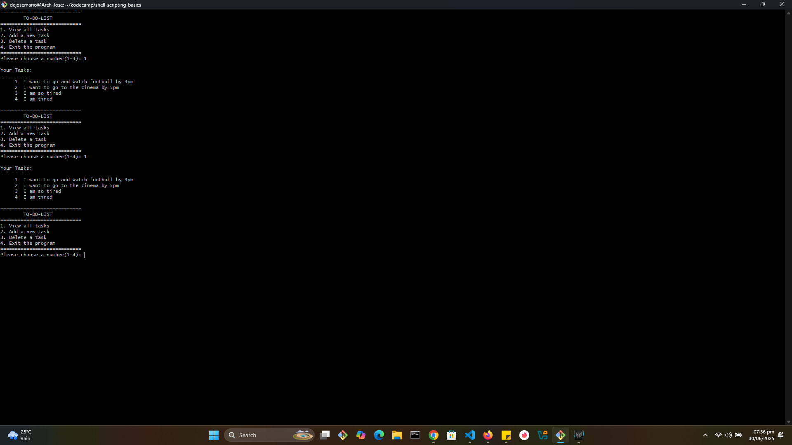
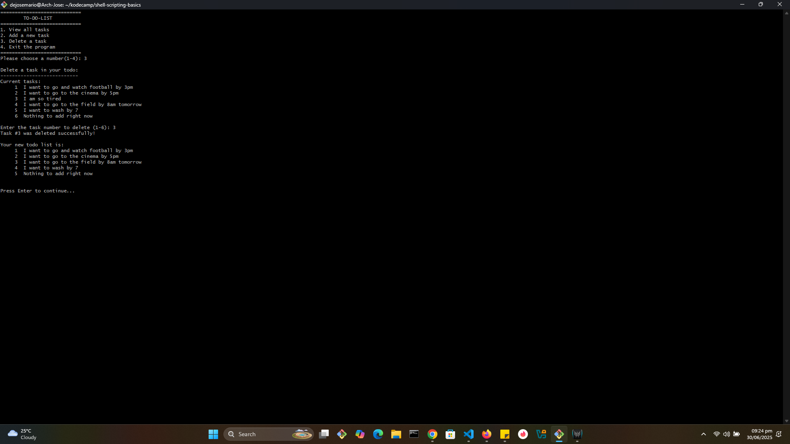
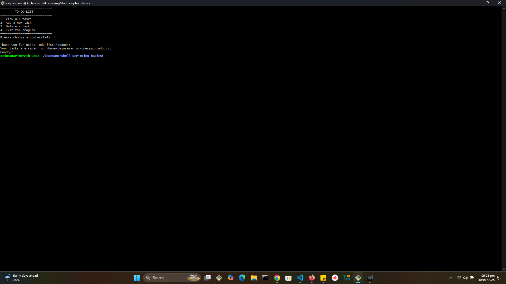

# shell-scripting-basics
This project is a simple command-line To-Do List application written in Bash. It allows users to manage their tasks from the terminal with an interactive menu. All tasks are saved in a file named todo.txt located in the user's home directory (~/todo.txt), making it easy to persist task data between sessions.

## Fixtures
- Add new tasks
- View all tasks with numbered lines
- Delete tasks by number
- Interactive menu system 
- Persistance storage in `~/kodecamp/todo.txt`

## 📸  Screenshots and Demonstrations

### 🧭  Screenshot 1: Main Menu
*The main menu interface showing all available options. It is the clean, intuitive menu that presents all available task management options*

This screenshots demonstrate the application's startup interface that appears when users execute the script. The first image shows the main menu with four numbered options for task management operations. The second image illustrates the empty state response when selecting "View all tasks" (option 1) on an uninitialized todo list, displaying the message "No tasks found. Your todo list is empty".

### ➕  Screenshot 2: Adding a new task

*Process of adding multiple tasks with interactive prompts and validation*

This screenshot demonstrates the task addition flow in action. When users select option 2 from the main menu, the application prompts them to enter tasks one by one. After each entry, the system confirms the addition with messages like:

- `"Go to market by 3: added"`
- `"Go to the store by 4pm: added"`

Users are asked after each entry:
> *"Add another task? (y/n):"*

This allows multiple tasks to be added in one go. Once the user chooses to stop, the program summarizes the session:
> *"Successfully added 3 task(s)!"*

Then, it returns to the main menu.

** This screenshot highlights the "View all tasks" functionality in action, used multiple times throughout the session. The application lists all stored tasks with numbered lines using the `nl` command, making it easy to reference specific tasks when performing operations like deletion.

Tasks shown include:
- *"I want to go and watch football by 3pm"*
- *"I want to go to the cinema by 3pm"*...

The numbered format enhances clarity and usability. This screenshot also illustrates the smooth transition between viewing tasks and returning to the main menu, showcasing the application’s interactive loop that enables seamless task management from start to finish.

### 🗑️ Screenshot 3: Delete task
*Demonstrates the deletion workflow and automatic reordering of tasks.*

This screenshot illustrates the task deletion process using option 3 from the menu. The session begins by displaying all six existing tasks, numbered with the `nl` command. Sample tasks include:

- *"I want to go and watch football by 3pm"*
- *"I want to go to the cinema by 3pm"*
- *"I want to go to the gym"*
- and others...

The user is prompted:
> *"Enter the task number to delete (1–6):"*

In this case, task **#3** is selected. The application uses the `sed` command to remove the corresponding line and confirms the action with:
> *"Task #3 was deleted successfully!"*

After deletion, the updated task list is shown with the remaining 5 tasks, and the numbering automatically adjusts. This ensures clarity and preserves the consistency of the task list for future interactions.

### 🚪 Screenshot 4: Exiting the Application
*Demonstrates a graceful and informative program exit.*

This screenshot captures the exit process when the user selects **option 4** from the main menu. Upon choosing to exit, the application responds with a friendly and professional farewell sequence:

- `"Thank you for using Todo List Manager!"`
- `"Your tasks are saved in: /home/dejosemario/kodecamp/todo.txt"`
- `"Goodbye!"`

The program then cleanly terminates and returns control to the shell prompt.

This sequence demonstrates thoughtful user experience design, and also confirms the user's exit.

